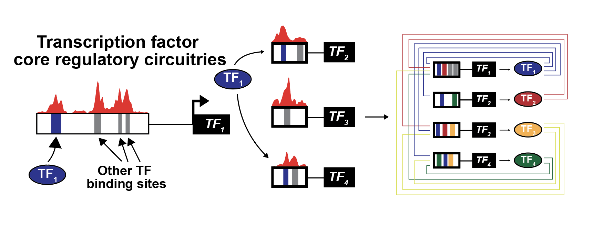

===
CRC
===

Transcriptional Core Regulatory Circuitry (CRC) analysis. CRC analysis leverages the observation
that almost all known master transcription factors are regulated by large enhancers or super
enhancers and that the master transcription factors bind to and regulate the enhancers of other
master transcription factors. CRC analysis takes in a set of enhancer or other cis-regulatory
regions and a list of active genes. For known transcription factors, CRC identifies those with
proximal enhancers and learns how transcription factors are connected to one another. For each
transcription factor, it does this by calculating the IN degree (the number of distinct
transcription factors that regulate it) and the OUT degree (the number of other transcription
factors regulated by the transcription factor in question). CRC analysis also determines which
enhancers are bound by each transcription factor, and this can be useful to identify transcription
factor cis-regulomes and gene expression programs.

Dependencies
============

The CRC software uses the following dependencies:

- Bamliquidator_

- Samtools_

- FIMO_

- fasta-get-markov_

Both FIMO and fasta-get-markov can be found in `The MEME Suite`_.

.. _Bamliquidator: https://github.com/BradnerLab/pipeline/wiki/bamliquidator
.. _Samtools: http://www.htslib.org/
.. _FIMO: http://meme-suite.org/doc/fimo.html
.. _fasta-get-markov: http://meme-suite.org/doc/fasta-get-markov.html
.. _The MEME Suite: http://meme-suite.org/doc/install.html

Install
=======

.. code::

  pip install git+https://github.com/linlabcode/CRC.git

Usage
=====

As a command line tool::

  crc -e <enhacer_text_file> -g <genome_build> -s <subpeak_bed_file> -c <chromosomes_dir> -o <out_dir> -n <name>

As a python library::

  import crc

  crc.crc(enhancers, genome_input, chrom_path, output, analysis_name, bam=None, subpeak_file=None,
          mask_file=None, activity_path=None, const_extension=100, number=1, motifs=None,
          config='')

|
Inputs/Options
--------------
|
All example files were generated with data from a publicly available sample under the GEO
accession number GSM2712746. Reads were aligned using the hg19 genome build.

|
**REQUIRED ARGUMENTS**

**-e/--enhancer_file**

ROSE2 generated enhancers table (_AllEnhancers_ENHANCER_TO_GENE.txt). `Example 
<https://www.charleslinlab.org/s/SRR5855055_peaks_SuperEnhancers_ENHANCER_TO_GENE.txt>`_

**-g/--genome**

Build of the genome to be used for the analysis. Currently supports HG38, HG19, MM10, and RN6.

**-c/--chrom-path**

Path to a folder with a seperate fasta file for each chromosome.

**-o/--output**

Output folder.

**-n/--name**

Name of the analysis.

|
**ONE OF THE FOLLOWING ARGUMENTS IS REQUIRED**

| If a BAM file is provided valley regions will be determined and used for motif search.

| If a BED file is provided the regions from the file will be used for motif search instead.
|

-b/--bam

Comma separated list of BAMs for valley finding.

-s/--subpeaks

BED file of regions to search for motifs. `Example 
<https://www.charleslinlab.org/s/SRR5855055_all_subpeak.bed>`_

|
**OPTIONAL ARGUMENTS**

-m/--mask

Masking file in BED format.

-a/--activity

Text file with active gene names. Either a list where each gene is in a new line or a table where
one column holds gene names. `Example 
<https://www.charleslinlab.org/s/SRR5855055_TSS_ACTIVE_-1000_1000.txt>`_

-l/--extension-length

Subpeak regions used in motif finding get extended by this length. Default is 100.

-N/--number

Number of non overlapping motifs in a region required to assign a binding event. Default is 1.

--motifs

An additional PWM file for the analysis.

--config

Genome configuration file to overwrite default paths.

|
Outputs
-------
**_ADJ_LIST.txt**  
  Adjacency list - the first label in a line is the source node and further labels in the line are
  target nodes.
**_all_motifs.bed**
  BED file containing motif regions.
**_all_subpeak.bed**
  BED file of all the subpeak regions.
**_all_subpeak.fasta**
  FASTA file of all the subpeak regions.
**_all_valleys.bed**
  BED file containing all valley regions used in motif search.
**_bg.meme**
  1st order markov background file used in FIMO for motif search.
**_CLIQUE_SCORES_DEGREE.txt**
  List of top 100 cliques or CRCs.
**_DEGREE_TABLE.txt**
  File describing how many TFs a specific TF interacts with (out degree) and how many TFs interact
  with a specific TF (in degree).
**_EDGE_LIST.txt**
  List of edges describing which TFs interact with each other.
**_EDGE_TABLE.txt**
  Similar to '_EDGE_LIST.txt' but it also contains the interaction region and enhancer name.
**_ENHANCER_TABLE.txt**
  Table of enhancers.
**_ENHANCER_TF_TABLE.txt**
  Table connecting enhancers to TFs.
**_ENRICHED_CLIQUE_FACTORS.txt**
  Node scoring; percentage of cliques the node is found in.
**_GENE_SUMMARY.txt**
  Table describing if a gene is a TF and which enhancers are/could be connected to it.
**_GENE_TABLE.txt**
  Table connecting genes and enhancers.
**_GENE_TF_TABLE.txt**
  Table connecting TFs and enhancers.
**_NODELIST.txt**
  List of nodes, the same as in '_ENRICHED_CLIQUE_FACTORS.txt'. These TFs are likely a part of a
  CRC.
**FIMO**
  Folder containing FIMO command (bash script) and output.

Authors
=======

Charles Y. Lin Baylor College of Medicine

Jost V. Koren Baylor College of Medicine

Alexander J. Federation University of Washington

Donald R. Polaski

